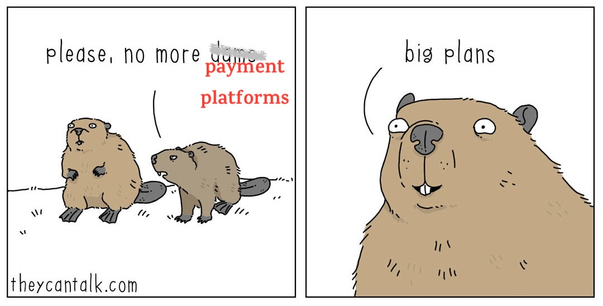

Недавно мне задали вопрос:

Допустим, нужно добавить оплаты на простой e-commerce сайт. MVP за 3 недели, один инженер. Как бы ты это сделал?

Реакция на такой вопрос сильно зависит от того, откуда вы пришли.

Если вы долго работали с большими платёжными системами, в голове сразу поднимается весь взрослый payment domain: PCI, 3DS, антифрод, refunds, chargebacks, ledger, accounting, reconciliation, support tooling, provider outages и длинный хвост operational complexity. На этом фоне “один инженер за 3 недели” звучит почти нереалистично.

А если вы когда-то добавляли оплату в небольшой интернет-магазин или на простой сайт, задача, наоборот, выглядит вполне земной: выбрать PSP, встроить checkout и довести happy path до рабочего состояния.

Именно здесь и возникает путаница. Одни слышат **“платёжную платформу”**, другие — **“checkout поверх PSP”**. Эта статья про второй случай.
<!-- 

-->

## Как я сужал задачу

В таких задачах полезно не прыгать сразу в “архитектуру платежей”, а пройти короткий путь:

**problem space → rough scope → candidate design-driving axes → scope tightening → active axes → archetypes → chosen envelope.**

Смысл этого процесса простой: scope нельзя сузить вслепую. Сначала нужно увидеть пространство архитектурных развилок, а уже потом осознанно отрезать лишнее. **Candidate axes помогают сузить scope, а scope определяет, какие axes останутся active.**

Для этой задачи rough scope у меня получился таким: не “вся платёжная платформа”, а **checkout payments slice для simple e-commerce MVP**. Дальше я посмотрел на candidate axes — hosted checkout vs custom form, one PSP vs multi-PSP, webhook-only vs webhook \+ reconciliation, manual ops vs automation и другие — и зафиксировал более узкий envelope: **one-time payment, один PSP, hosted checkout, без custom card handling, без multi-PSP routing и без platform-level payment complexity**.

После такого сужения большие развилки уже закрыты. Внутри выбранного MVP остаются только те оси, которые всё ещё реально меняют дизайн. Именно они и становятся **active axes**.

**Candidate axes** и **scope tightening** я отдельно вынес в [payments-design-axes](). Здесь дальше интереснее уже не всё пространство решений, а то, **каким именно получается выбранный checkout MVP**.

## Active axes

После такого сужения scope большие развилки уже зафиксированы: это **не payment platform**, а **checkout MVP**, не multi-PSP, а **один провайдер**, не custom card flow, а **hosted checkout**. После этого остаются только несколько **активных архитектурных осей** — то есть развилки, которые всё ещё реально меняют дизайн внутри выбранной рамки.

Первая ось — **PSP-led flow vs app-owned payment lifecycle**.  
Можно сделать очень тонкую интеграцию, в которой PSP фактически остаётся главным владельцем payment flow, а наш backend только создаёт checkout session и обновляет order по результату. А можно взять внутренний payment lifecycle под свой контроль: завести отдельную сущность `payment`, свой create-payment flow, свою state machine и webhook processing как входящий поток событий. Именно эта ось сильнее всего отделяет просто checkout integration от собственного payment orchestration layer.

Вторая ось — **webhook-only vs webhook \+ reconciliation**.  
Можно сделать “чистую” схему и полностью верить webhook-ам, а можно сразу закладывать repair path для lost webhook и ambiguous state. Для платежей я бы почти всегда выбирал второй вариант: он менее элегантный, но гораздо надёжнее. **Trade-off:** repairability важнее архитектурной чистоты. Цена решения — больше operational complexity.

Третья ось — **простая vs более богатая state machine**.  
Для MVP хочется держать минимальный набор состояний и не тащить внутрь системы весь взрослый payment domain. Но слишком грубая модель тоже вредна: потом трудно разбирать инциденты, зависшие статусы и неясные переходы. Здесь нужен баланс, а не крайность.

Четвёртая ось — **manual ops vs automation**.  
Редкие хвостовые кейсы можно сначала чинить руками через простой admin/support flow, а можно сразу строить более автоматизированный recovery path. Для MVP я бы сознательно оставил часть редких сценариев на manual handling, но не экономил бы на correctness-critical вещах: idempotency, webhook verification и repair path.

Именно эти оси уже формируют реальный shape решения. Не “как устроены платежи вообще”, а **каким именно получится checkout MVP внутри уже жёстко суженной рамки**.

## Archetypes

После того как scope сужен, полезно не прыгать сразу к одной “правильной архитектуре”, а сначала собрать несколько **archetype** — несколько связных форм решения, которые естественно получаются из выбранных active axes.

Я бы проводил границу не по числу компонентов, а по трём вопросам:

1. Кто владеет payment lifecycle — PSP или наша система?  
2. Где живёт source of truth для промежуточных и финальных состояний?  
3. Какие failure cases система закрывает сама, а какие оставляет на manual handling?

Получается три archetype.

**Thin checkout integration** — это вариант, где мы в первую очередь **подключаем checkout PSP к order flow**, а не строим собственный payment domain. PSP здесь фактически владеет жизненным циклом платежа, а наш backend делает минимально необходимое: создаёт checkout session, хранит ссылку на provider payment/session, принимает webhook и переводит order в `paid` или `failed`. В такой модели payment обычно не становится самостоятельной богатой сущностью, reconciliation либо отсутствует, либо остаётся ручным, а редкие неоднозначные кейсы закрываются через Dashboard провайдера и manual ops. Это самый быстрый путь, но он держится в основном на happy path и минимальных guardrails.

**Lean Payment Orchestrator** — это всё ещё checkout MVP вокруг одного PSP, но здесь payment уже становится **first-class внутренней сущностью**, а не просто атрибутом заказа. Наша система уже явно владеет payment lifecycle: создаёт payment attempt, держит свою state machine, обрабатывает webhook-и как входящие события, дедуплицирует их, хранит связь `order ↔ payment`, поддерживает idempotency на create-payment path и умеет дочищать lost webhook или ambiguous state через reconciliation. PSP по-прежнему делает actual money movement и hosted checkout, но внутренняя система уже отвечает не только за happy path, а за корректность и repairability платёжного контура.

**Early payment platform** — более широкий вариант, в котором мы начинаем проектировать уже не checkout slice, а зачаток внутренней payment platform. Здесь обычно появляются более общая абстракция над PSP, richer payment domain model, задел под multi-PSP routing, более сложные payment flows и постепенный выход за рамки одного checkout use case.

Эти archetype полезны не потому, что один из них “правильный”, а потому что они помогают не смешивать в одну кучу три разных класса решения: **подключить оплату**, **взять под контроль payment lifecycle**, **начать строить платформу**.

## Chosen envelope

Для кейса “простой e-commerce, один инженер, 3 недели” я бы выбрал **Lean Payment Orchestrator**, но в очень сдержанном виде.

Это значит, что я всё ещё проектирую не payment platform, а **checkout payments slice** вокруг одного PSP. Платёж — **one-time**, checkout — **hosted**, карточные данные остаются на стороне провайдера. Но при этом я не хочу, чтобы система заканчивалась на “создали checkout session и надеемся, что всё доедет”. Поэтому мой backend всё-таки берёт на себя несколько вещей: создание и хранение payment attempt, связь payment с order, idempotency на create-payment path, webhook processing, простую внутреннюю state machine и минимальный reconciliation/repair path для lost webhook или ambiguous state.

При этом я сознательно оставляю за границей этой версии multi-PSP routing, stored cards, refunds, disputes, сложный auth/capture flow и прочую platform-level payment complexity.

## Что мы сознательно не будем делать

Чтобы задача вообще помещалась в формат “один инженер, три недели”, нужно явно зафиксировать не только то, что мы строим, но и то, чего мы **не** строим. В этой версии это не платёжная платформа и не попытка забрать весь payment domain под себя.

Мы сознательно не делаем custom payment form и не собираем карточные данные у себя, а используем hosted checkout провайдера. Мы не берём multi-PSP routing, fallback между эквайерами, stored cards, recurring payments, refunds, disputes, antifraud, ledger/accounting-first модель и прочую platform-level payment complexity. Не потому, что всё это неважно, а потому, что это уже другой класс задачи.

## Где нельзя срезать углы

Узкий scope не означает, что можно халтурить в correctness-critical местах. В платежах есть несколько вещей, на которых как раз нельзя экономить.

Нельзя полагаться только на redirect пользователя как на подтверждение успешной оплаты — source of truth должен быть на серверной стороне. Нельзя оставлять create-payment path без idempotency, иначе первый же retry или двойной клик превращается в риск дубля. Нельзя относиться к webhook-ам как к идеально надёжному каналу: нужны верификация, deduplication и repair path для lost webhook или ambiguous state. И нельзя терять связь между payment и order или оставлять систему без внятной state machine, иначе любой сбой быстро превращается в support pain и ручной хаос.

Если совсем коротко: **мы режем scope, но не режем correctness**. Упрощать можно почти всё, кроме тех мест, где ошибка превращается в двойное списание, потерянный статус или сломанный order state.

На практике самые дорогие ошибки здесь обычно очень приземлённые. Пользователь может нажать “Оплатить” дважды, фронт может повторить запрос после таймаута, а webhook handler легко написать слишком наивно — без проверки подписи, deduplication и безопасной повторной обработки. Именно поэтому даже в очень узком MVP нельзя экономить на idempotency, server-side confirmation и repair path.

## Что я бы реально сделал за 3 недели

Если задача звучит как “добавить оплаты на e-commerce сайт за 3 недели силами одного инженера”, я бы не пытался за это время построить payment platform. Я бы целился в гораздо более узкий результат: **working checkout MVP** вокруг одного PSP.

На первой неделе я бы собрал **happy path**: зафиксировал бы простую модель `order` и `payment`, определил бы минимальную state machine, сделал бы create-payment endpoint и интеграцию с hosted checkout у провайдера. К концу этой недели пользователь уже должен уметь нажать Pay, а backend — создать payment attempt и отправить его на checkout page PSP.

На второй неделе я бы занялся тем, что превращает интеграцию в реальную платёжную систему, а не в демо: webhook endpoint, server-side confirmation, idempotency, обновление `payment` и `order`, защита от дублей и базовая операционная видимость. Именно здесь появляется настоящий source of truth для результата оплаты.

Третью неделю я бы потратил не на новые фичи, а на **repairability**. Добавил бы reconciliation для lost webhook и ambiguous state, прошёлся бы по самым дорогим failure cases — double click, retry, duplicate webhook, повторная попытка оплаты уже оплаченного заказа — и довёл бы систему до состояния, где её можно не только показать, но и поддерживать.

Итог первой версии для меня выглядел бы так: один PSP, hosted checkout, create payment, webhook-driven completion, idempotency, внятная state machine, reconciliation и минимальный support/debugging path.

Всё остальное я бы сознательно оставил **после первой версии**: второй PSP, refunds, stored cards, recurring payments, более богатую payment state machine, платформенную абстракцию над провайдерами, antifraud и прочую platform-level complexity. Не потому, что это неважно, а потому, что это уже следующий класс задачи.

### Что ещё помогает реально уложиться в 3 недели

Чтобы такой MVP вообще помещался в короткий срок, важно экономить не только на scope, но и на служебной обвязке. Я бы не спешил строить свой payment backoffice: у PSP обычно уже есть базовый operational UI — история платежей, статусы, поиск, ручные возвраты. Для первого релиза это хороший способ не тратить время на внутренний интерфейс, который пока не даёт новой бизнес-ценности.

То же самое касается и checkout flow: hosted checkout не просто сокращает объём работ, а позволяет не открывать отдельный фронт работ вокруг card data handling, PCI DSS, 3DS и собственного payment UI. В большой компании такой контур может строиться долго и отдельными командами. В MVP мы сознательно оставляем его за пределами системы.

## Какой PSP я бы выбрал для европейского рынка

Если рынок — Европа, я бы в первой версии смотрел не на “самый известный глобальный PSP”, а на то, кто лучше закрывает **hosted checkout**, **SCA/3DS** и **локальные методы оплаты**.

Мой первый кандидат — **Mollie**. У них короткий и понятный flow: создать payment, отправить пользователя на hosted checkout, обработать webhook. Для европейского e-commerce это особенно удобно, потому что у них сильный фокус на локальных payment methods: iDEAL, Bancontact, EPS, SEPA Bank Transfer, SEPA Direct Debit, Trustly, TWINT, Vipps и другие. Плюс у Mollie есть публичный pricing, что полезно для MVP-оценки.

- Docs: [Accepting payments](https://docs.mollie.com/docs/accepting-payments)  
- Docs: [Hosted checkout](https://docs.mollie.com/docs/hosted-checkout)  
- Pricing: [Mollie pricing](https://www.mollie.com/pricing)

Если смотреть на следующий шаг после MVP, я бы уже рассматривал **Adyen**. У них базовый **Sessions flow** остаётся достаточно дружелюбным, но в целом это уже более зрелый европейский payment stack. У них есть отдельная документация по **PSD2 / SCA**, а pricing изначально ближе к enterprise-модели.

- Docs: [Build your integration](https://docs.adyen.com/online-payments/build-your-integration)  
- Docs: [PSD2 / SCA compliance and implementation guide](https://docs.adyen.com/online-payments/psd2-sca-compliance-and-implementation-guide)  
- Pricing: [Adyen pricing](https://www.adyen.com/pricing)

**Checkout.com** я бы поставил рядом как ещё один европейски релевантный hosted-page вариант. Их Hosted Payments Page хорошо подходит для сценария, где чувствительные платёжные данные не должны проходить через ваш backend. Это уже более enterprise-oriented путь, и pricing у них тоже выглядит соответствующе.

- Docs: [Hosted Payments Page](https://www.checkout.com/docs/payments/accept-payments/accept-a-payment-on-a-hosted-page)  
- Pricing: [Checkout.com pricing](https://www.checkout.com/pricing)

**Stripe** я бы не убирал совсем, но в европейской статье не делал бы его единственным дефолтом. У Stripe по-прежнему очень сильный hosted checkout, хороший developer experience и понятный integration path. Если нужен глобальный devex-first вариант, это по-прежнему сильный кандидат. Но в EU-контексте я бы ставил его рядом с Mollie и Adyen, а не автоматически выше них.

- Docs: [Online payments / Checkout](https://docs.stripe.com/payments/online-payments)  
- Docs: [Stripe Checkout](https://stripe.com/payments/checkout)  
- Pricing: [Stripe pricing](https://stripe.com/pricing)

Если совсем коротко, мой shortlist для Европы выглядел бы так: **Mollie для первого MVP**, **Adyen — когда уже важны acceptance и economics**, **Checkout.com — как hosted-page enterprise alternative**, **Stripe — как сильный глобальный вариант, но не обязательно как европейский дефолт**.

Прямой эквайринг я бы вообще не рассматривал как “следующий шаг после MVP”. До него имеет смысл доходить только тогда, когда processing cost и payment ownership уже стали отдельной бизнес-задачей.

## Почему реальные платёжные системы всё равно вырастают в много команд

На старте задача маленькая не потому, что платежи простые, а потому, что мы жёстко фиксируем почти все оси сложности. Большая команда появляется тогда, когда эти оси снова начинают двигаться: добавляются рынки, способы оплаты, требования к correctness, fraud-control и operational reliability. В этот момент “принять оплату” превращается в полноценную денежную платформу.

## Что дальше

Я хочу оставить этот текст как **живой документ**, который будет уточняться и редактироваться со временем. Чем больше я думаю про эту задачу и прогоняю её через интервьюшный и практический контекст, тем больше хочется не “закрыть тему”, а постепенно сделать из неё более точную рабочую модель.

Следующие шаги для меня — отдельно разобрать archetypes, подробнее пройтись по интеграциям с конкретными PSP и описать направления эволюции архитектуры: в какой момент checkout MVP перестаёт быть достаточным и начинает расти в более широкий платёжный контур.
