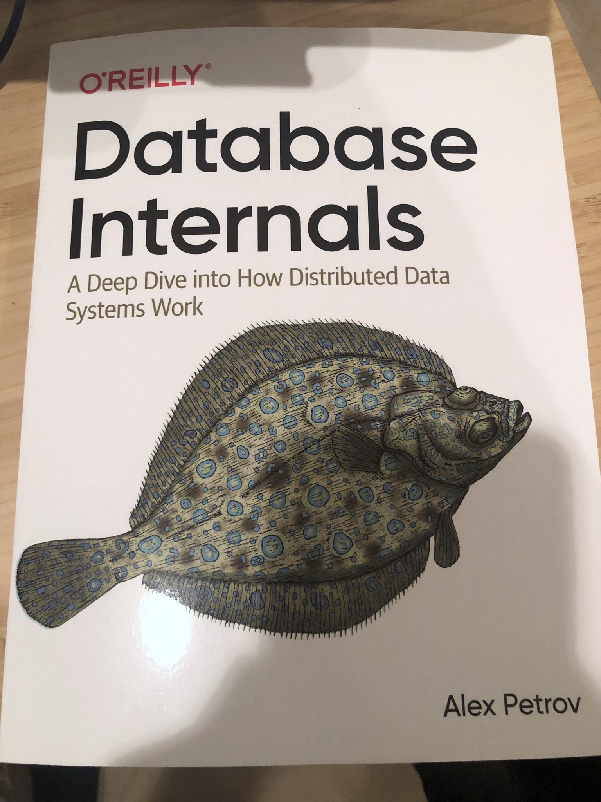

A good book or paper (for me) has lots of references. "Database Internals" has 220. You can use these references to learn more about related concepts in more detail.

Guide or key to 220 papers. Site https://www.databass.dev

- distributed database systems
- data integrity, consistency, redundancy
- horizontal scaling (scaling out)
- eventually consistency databases
- How do I learn more about database internals?
- Details of storage engine implementation
- different B-Tree variants,
- log-structured storage
- cover recent concepts

This book contains concise summaries of important database systems concepts and can serve as a guide for those who’d like to dig in deeper, or as a cheat sheet for those already familiar with these concepts.
This book will help people who build software that uses database systems: software developers, reliability engineers, architects, and engineering managers.

Having an overview and a general understanding of how database systems work will help in case something goes wrong. Understanding terminology and knowing what’s inside will enable you to use your tools more productively to troubleshoot, identify, and avoid potential risks and bottlenecks.
This book is also for curious minds: for the people who like learning things without immediate necessity, those who spend their free time hacking on something fun, creating compilers, learning programming languages, and absorbing new information.

One of the advantage of learning the fundamental concepts, proofs, and algorithms is that they never grow old. Of course, there will always be new ones, but new algorithms are often created after finding a flaw or room for improvement in a classical one. Knowing the history helps to understand differences and motivation better.

This book is about the algorithms and concepts used in all kinds of database systems, with a focus on a storage engine and the components responsible for distribution.

To collect material for this book, author studied over 15 books, more than 300 papers. countless blog posts, source code, and the documentation for several open source databases.

The book is arranged into two parts that discuss the subsystems and components responsible for storage and distribution.

Book covers disk-based storage structures, in-memory ones, B-Trees, algorithms for efficiently maintaining B-Tree structures on disk.

Theoretical concepts for building fault-tolerant distributed systems, and which problems, constraints, and complications we face in a distributed environment.

Algorithms for failure detection, leader election.
